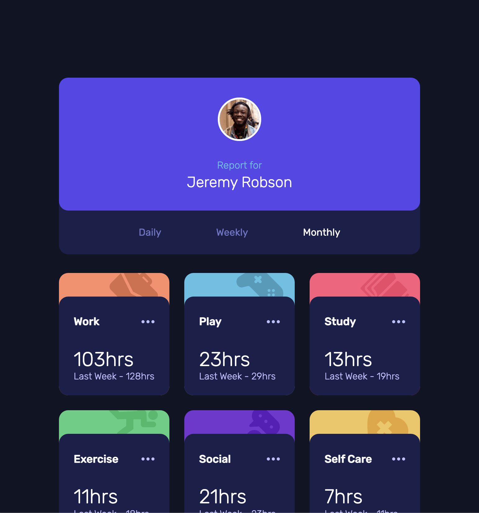
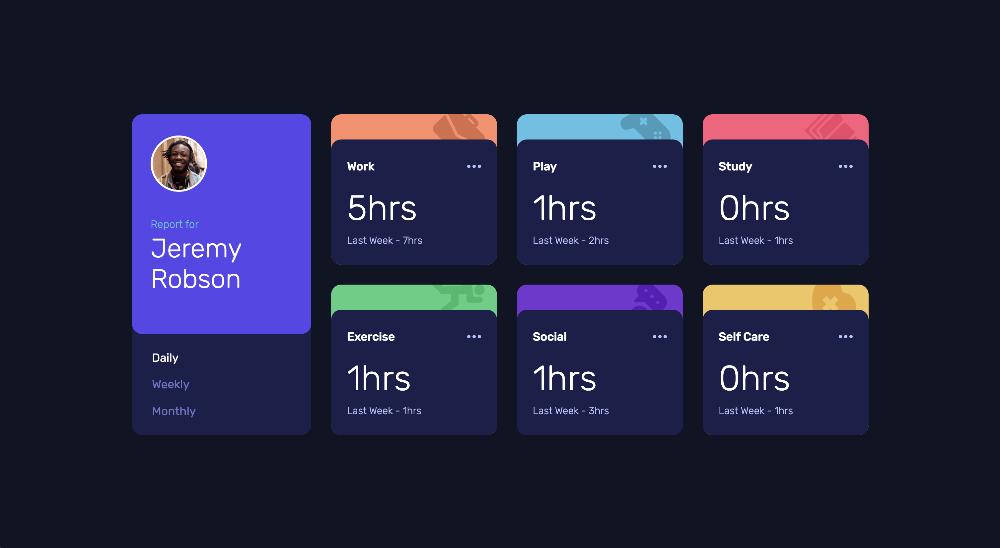

# Frontend Mentor - Time tracking dashboard solution

This is a solution to the [Time tracking dashboard challenge on Frontend Mentor](https://www.frontendmentor.io/challenges/time-tracking-dashboard-UIQ7167Jw). Frontend Mentor challenges help you improve your coding skills by building realistic projects. 

## Table of contents

- [Overview](#overview)
  - [The challenge](#the-challenge)
  - [Screenshot](#screenshot)
  - [Links](#links)
- [My process](#my-process)
  - [Built with](#built-with)
  - [What I learned](#what-i-learned)
  - [Continued development](#continued-development)
- [Author](#author)

## Overview

### The challenge

Users should be able to:

- View the optimal layout for the site depending on their device's screen size
- See hover states for all interactive elements on the page
- Switch between viewing Daily, Weekly, and Monthly stats

### Screenshot

### Links

- Solution URL: [FrontendMentor.io](https://www.frontendmentor.io/solutions/dynamic-time-tracking-dashboard-built-w-codux-react-and-ts-OgZdC2ugTB)
- Live Site URL: [https://ericsalvi.github.io/time-tracking-dashboard/](https://ericsalvi.github.io/time-tracking-dashboard/)

## My process

### Built with

- [Codux](https://www.codux.com/) - Visual IDE for React
- [React](https://reactjs.org/) - JS library
- Flexbox
- CSS Grid
- Mobile-first workflow
- TypeScript

### What I learned

I learned so much when using the brand new tool to myself, Codux. I always struggled when building out React Apps as I am more of a visiual designer rather than a pure coder. This is were Codux comes in for someone like myself who really enjoys Frontend Web Development and finds React facintating, Codux made it much more enjoyable for myself.

Plus I got to learn a new tool. This tool also uses TypeScript which was new to me. 

### Continued development

I will continue to play around with Codux but for any new Frontend Mentor challenges that have a need for React and JS interactivity, I will be definietly attempting more React/Codux builds.

## Author

- Website - [Eric Salvi](https://github.com/ericsalvi)
- Frontend Mentor - [@ericsalvi](https://www.frontendmentor.io/profile/ericsalvi)